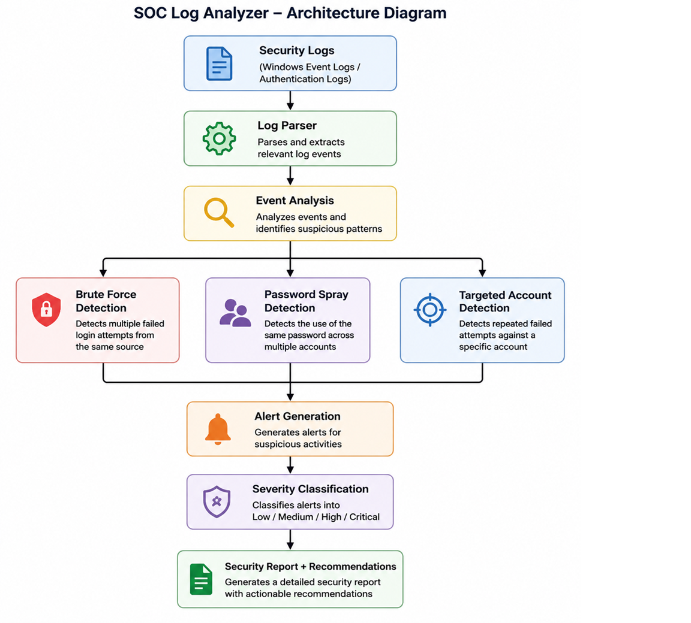
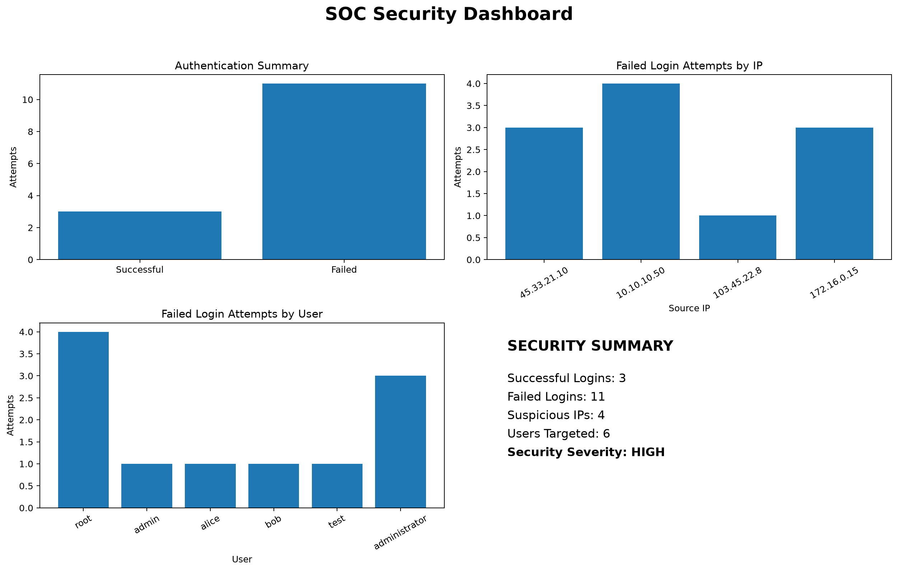

# SOC Log Analyzer

A Python-based Security Operations Center (SOC) log analysis tool that analyzes authentication logs to identify suspicious login activity, detect brute-force attacks, targeted account attacks, and password spraying, classify security severity, and generate actionable security reports.

## Features

* Parses authentication and security logs
* Analyzes successful and failed login attempts
* Groups failed login attempts by username and IP address
* Detects potential brute-force attacks
* Detects rapid brute-force activity within a configurable time window
* Identifies targeted account attacks
* Detects password-spraying activity across multiple accounts
* Identifies suspicious source IP addresses
* Generates HIGH-severity security alerts
* Assigns LOW, MEDIUM, and HIGH security severity
* Generates security recommendations
* Creates a security report automatically
* Uses configurable detection thresholds
* Uses rule-based detection logic suitable for SOC monitoring exercises

## Detection Capabilities

### 1. Brute-Force Detection

Detects IP addresses with repeated failed login attempts.

```python
BRUTE_FORCE_THRESHOLD = 3
```

An IP address reaching or exceeding the configured threshold is considered suspicious.

### 2. Rapid Brute-Force Detection

The analyzer also evaluates failed authentication events within a configurable time window.

```python
BRUTE_FORCE_WINDOW_MINUTES = 2
```

This helps identify repeated login attempts occurring within a short period.

### 3. Targeted Account Attack Detection

Detects repeated failed login attempts against the same user account.

```python
TARGETED_ACCOUNT_THRESHOLD = 3```

This can help identify attempts focused on accounts such as administrative or privileged users.

### 4. Password-Spray Detection

The analyzer identifies cases where a single source IP attempts authentication against multiple user accounts.

```python
PASSWORD_SPRAY_THRESHOLD = 2
```

This provides a basic rule-based approach for identifying password-spraying behavior.

## Severity Classification

| Severity | Condition                                                     |
| -------- | ------------------------------------------------------------- |
| LOW      | No suspicious IP detected                                     |
| MEDIUM   | Multiple failed login attempts without suspicious IP activity |
| HIGH     | Suspicious IP activity detected                               |

## Sample Analysis

The included sample log dataset contains:

* **10** total log entries
* **10** successfully parsed events
* **8** failed login attempts
* **2** successful login attempts
* **2** suspicious IP addresses

The analyzer identifies multiple security events, including:

* Brute-force activity
* Targeted account attacks
* Password spraying

The resulting analysis is classified as:

```text
Security Severity: HIGH
```

## Example Security Alerts

```text
ALERT | HIGH | 2026-08-13 10:16:01 | IP=45.33.21.10 | User=root | Attempts=3 | Rule=BRUTE_FORCE_DETECTION

ALERT | HIGH | 2026-08-13 10:16:01 | IP=45.33.21.10 | User=root | Attempts=3 | Rule=TARGETED_ACCOUNT_ATTACK

ALERT | HIGH | 2026-08-13 10:30:01 | IP=10.10.10.50 | User=admin | Attempts=4 | Rule=PASSWORD_SPRAY_DETECTION
```

## Technologies Used

* Python
* Regular Expressions (`re`)
* `datetime`
* File and log processing
* Rule-based threat detection
* Authentication event analysis
* Security alert generation

## Project Structure

```text
SOC-Log-Analyzer/
│
├── logs/
│   └── security.log
│
├── reports/
│   └── security_report.txt
│
├── screenshots/
│
├── src/
│   └── log_analyzer.py
│
├── tests/
│
├── .gitignore
├── LICENSE
├── README.md
└── requirements.txt
```

## How It Works

```text
Authentication Logs
        |
        v
Log Parsing
        |
        v
Authentication Event Analysis
        |
        v
Failed Login Detection
        |
        v
IP / Username Aggregation
        |
        +----------------------+
        |                      |
        v                      v
Brute-Force Detection   Targeted Account Detection
        |
        v
Password-Spray Detection
        |
        v
Security Alert Generation
        |
        v
Severity Classification
        |
        v
Security Report & Recommendations
```

## How to Run

### 1. Clone the repository

```bash
git clone <your-repository-url>
cd SOC-Log-Analyzer
```

### 2. Run the analyzer

```bash
python src/log_analyzer.py
```

### 3. View the generated report

The analyzer automatically creates:

```text
reports/security_report.txt
```

The report contains:

* Analysis timestamp
* Log entry statistics
* Failed login statistics
* Security alerts
* Suspicious IP addresses
* Security severity
* Security recommendations

## Example Output
## Project Architecture

The following architecture illustrates the SOC Log Analyzer workflow from log ingestion and parsing through threat detection, alert generation, severity classification, and security reporting.




```text
SOC Log Analyzer
================

Total log entries: 10
Successfully parsed events: 10
Failed login attempts: 8
Successful login attempts: 2

Suspicious IP count: 2
Security Severity: HIGH

Security Recommendations:
- Investigate suspicious IP addresses for potential brute-force activity.
- Review authentication events associated with the affected accounts.
- Consider temporarily blocking or rate-limiting suspicious sources.
- Review targeted user accounts for unauthorized access attempts.
```

## SOC / Blue-Team Skills Demonstrated

This project demonstrates practical foundational skills relevant to SOC Analyst and Cybersecurity Analyst roles:

* Security log analysis
* Authentication monitoring
* Event parsing
* Failed-login investigation
* IP-based threat detection
* User-based threat detection
* Brute-force detection
* Password-spray detection
* Targeted account attack detection
* Rule-based alert generation
* Severity classification
* Security reporting
* Basic incident investigation and recommendations

## Detection Rules

The SOC Log Analyzer applies rule-based detection logic to identify common authentication-based security threats.

| Detection Rule | Trigger Condition | Severity | SOC Response |
|---|---|---|---|
| `BRUTE_FORCE_DETECTION` | 3 or more failed login attempts from the same IP | HIGH | Investigate source IP and consider temporary blocking |
| `PASSWORD_SPRAY_DETECTION` | Failed login attempts against 2 or more different accounts from the same IP | HIGH | Investigate source IP and affected accounts |
| `TARGETED_ACCOUNT_ATTACK` | 3 or more failed login attempts against the same user | HIGH | Investigate targeted account and authentication activity |
| `SUSPICIOUS_IP_ACTIVITY` | IP generates repeated suspicious authentication failures | MEDIUM/HIGH | Review IP reputation and related events |

### Detection Thresholds

```text
BRUTE_FORCE_THRESHOLD = 3
BRUTE_FORCE_WINDOW_MINUTES = 2
PASSWORD_SPRAY_THRESHOLD = 2
TARGETED_ACCOUNT_THRESHOLD = 3

## Incident Analysis

### Incident 1: Brute-Force Attack

The analyzer detected a high-severity brute-force attack from `45.33.21.10`.

| Incident Attribute | Details |
|---|---|
| Incident Type | Brute-Force Authentication Attack |
| Severity | HIGH |
| Source IP | `45.33.21.10` |
| Target Account | `root` |
| Failed Attempts | 3 |
| Detection Rule | `BRUTE_FORCE_DETECTION` |
| Status | Detected — Requires Investigation |

### SOC Investigation

Three failed login attempts were detected against the `root` account from the same source IP within a short period.

This behavior is consistent with a brute-force authentication attempt.

### Analyst Assessment

The activity is suspicious because:

1. Multiple authentication failures came from the same IP.
2. The `root` account was specifically targeted.
3. The activity triggered the `BRUTE_FORCE_DETECTION` rule.
4. The number of attempts reached the configured detection threshold.

### Recommended SOC Response

1. **Validate** the authentication events and confirm whether the activity was authorized.
2. **Investigate** the source IP and related authentication events.
3. **Contain** the activity by considering blocking or rate-limiting the suspicious source according to security policy.
4. **Protect** the targeted account by reviewing its authentication controls.
5. **Document** the incident and response actions.

### Analyst Conclusion

The activity represents a **HIGH-severity authentication threat** consistent with a brute-force attack and requires further investigation and appropriate containment.

## MITRE ATT&CK Mapping

The detected authentication threats are mapped to relevant MITRE ATT&CK techniques to provide standardized classification of adversary behavior.

| Detection Rule | Attack Technique | MITRE ATT&CK ID | Description |
|---|---|---|---|
| `BRUTE_FORCE_DETECTION` | Brute Force | `T1110` | Adversaries may repeatedly attempt authentication to gain access to an account. |
| `PASSWORD_SPRAY_DETECTION` | Password Spraying | `T1110.003` | Adversaries may use a small number of commonly used passwords against multiple accounts. |
| `TARGETED_ACCOUNT_ATTACK` | Brute Force | `T1110` | Repeated authentication attempts are directed against a specific user account. |

### SOC Relevance

MITRE ATT&CK mapping helps SOC analysts translate raw authentication alerts into a standardized description of adversary behavior.

This improves:

1. **Alert classification**
2. **Incident investigation**
3. **Threat hunting**
4. **Detection engineering**
5. **Security reporting**

### Analyst Note

The MITRE ATT&CK mappings represent the behavior detected by this rule-based analyzer. They do not confirm that a real-world adversary used a specific technique; further investigation and supporting evidence would be required.

## IOC / Threat Intelligence

The analyzer extracts and organizes security-relevant indicators from authentication logs to support SOC investigation and threat intelligence workflows.

### Identified Indicators of Compromise

| IOC Type | Indicator | Context | Severity | Detection |
|---|---|---|---|---|
| IP Address | `45.33.21.10` | Repeated failed logins against `root` | HIGH | Brute Force / Targeted Account |
| IP Address | `10.10.10.50` | Failed authentication against multiple accounts | HIGH | Password Spraying |
| IP Address | `103.45.22.8` | Failed login against `root` | HIGH | Targeted Account |
| IP Address | `172.16.0.15` | Repeated failed logins against `administrator` | HIGH | Brute Force / Targeted Account |

### IOC Investigation Workflow

A SOC analyst can use the identified indicators to:

1. Investigate the source IP address using approved threat-intelligence sources.
2. Review related authentication events from the same IP.
3. Identify other accounts targeted by the source.
4. Check whether the indicator appears in other security logs.
5. Determine whether the activity is malicious, suspicious, or authorized.
6. Apply appropriate containment actions according to organizational policy.

### Threat Intelligence Note

The IP addresses identified by this project are **sample indicators generated from the project's test dataset**. They should not be treated as confirmed malicious infrastructure without additional threat-intelligence evidence.

External threat-intelligence services can be integrated in future versions to enrich indicators with reputation, geolocation, ASN, and known threat information.

## Security Dashboard

The SOC Log Analyzer includes an automated security dashboard that visualizes authentication activity and highlights suspicious login behavior.

<p align="center">
  
</p>

### Dashboard Components

- **Authentication Summary** — compares successful and failed login attempts.
- **Failed Login Attempts by IP** — identifies source IP addresses generating suspicious authentication failures.
- **Failed Login Attempts by User** — highlights accounts targeted by failed authentication attempts.
- **Security Summary** — provides a quick overview of authentication activity and security severity.

The dashboard is generated automatically from the authentication log dataset using Python and Matplotlib.

## Future Improvements

Potential improvements include:

* Add unit tests for all detection rules
* Support multiple log formats
* Add CSV and JSON log ingestion
* Add configurable detection rules through a configuration file
* Add automated IP blocking integration
* Add dashboard visualization
* Add email or webhook alerting
* Integrate with a SIEM platform
* Add statistical anomaly detection
* Add automated test coverage and CI/CD

## Security Note

This project is intended for educational and defensive cybersecurity purposes.

It demonstrates rule-based security log analysis and should not be considered a replacement for a production SIEM or enterprise security monitoring platform.

## License

This project is licensed under the MIT License.
