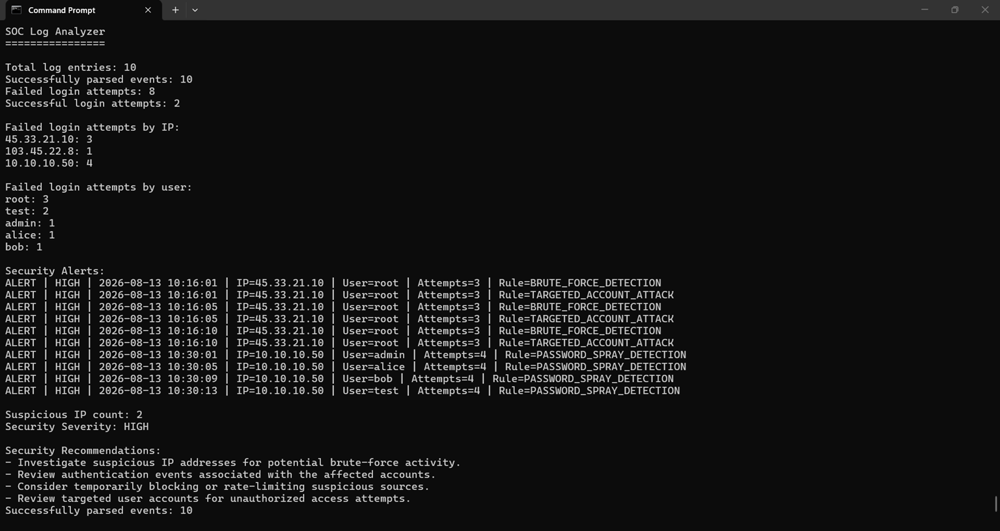

# SOC Log Analyzer

A Python-based Security Operations Center (SOC) log analysis tool that analyzes authentication logs to identify suspicious login activity, detect brute-force attacks, targeted account attacks, and password spraying, classify security severity, and generate actionable security reports.

## Features

* Parses authentication and security logs
* Analyzes successful and failed login attempts
* Groups failed login attempts by username and IP address
* Detects potential brute-force attacks
* Detects rapid brute-force activity within a configurable time window
* Identifies targeted account attacks
* Detects password-spraying activity across multiple accounts
* Identifies suspicious source IP addresses
* Generates HIGH-severity security alerts
* Assigns LOW, MEDIUM, and HIGH security severity
* Generates security recommendations
* Creates a security report automatically
* Uses configurable detection thresholds
* Uses rule-based detection logic suitable for SOC monitoring exercises

## Detection Capabilities

### 1. Brute-Force Detection

Detects IP addresses with repeated failed login attempts.

```python
BRUTE_FORCE_THRESHOLD = 3
```

An IP address reaching or exceeding the configured threshold is considered suspicious.

### 2. Rapid Brute-Force Detection

The analyzer also evaluates failed authentication events within a configurable time window.

```python
BRUTE_FORCE_WINDOW_MINUTES = 2
```

This helps identify repeated login attempts occurring within a short period.

### 3. Targeted Account Attack Detection

Detects repeated failed login attempts against the same user account.

```python
TARGETED_ACCOUNT_THRESHOLD = 3
```

This can help identify attempts focused on accounts such as administrative or privileged users.

### 4. Password-Spray Detection

The analyzer identifies cases where a single source IP attempts authentication against multiple user accounts.

```python
PASSWORD_SPRAY_THRESHOLD = 2
```

This provides a basic rule-based approach for identifying password-spraying behavior.

## Severity Classification

| Severity | Condition                                                     |
| -------- | ------------------------------------------------------------- |
| LOW      | No suspicious IP detected                                     |
| MEDIUM   | Multiple failed login attempts without suspicious IP activity |
| HIGH     | Suspicious IP activity detected                               |

## Sample Analysis

The included sample log dataset contains:

* **10** total log entries
* **10** successfully parsed events
* **8** failed login attempts
* **2** successful login attempts
* **2** suspicious IP addresses

The analyzer identifies multiple security events, including:

* Brute-force activity
* Targeted account attacks
* Password spraying

The resulting analysis is classified as:

```text
Security Severity: HIGH
```

## Example Security Alerts

```text
ALERT | HIGH | 2026-08-13 10:16:01 | IP=45.33.21.10 | User=root | Attempts=3 | Rule=BRUTE_FORCE_DETECTION

ALERT | HIGH | 2026-08-13 10:16:01 | IP=45.33.21.10 | User=root | Attempts=3 | Rule=TARGETED_ACCOUNT_ATTACK

ALERT | HIGH | 2026-08-13 10:30:01 | IP=10.10.10.50 | User=admin | Attempts=4 | Rule=PASSWORD_SPRAY_DETECTION
```

## Technologies Used

* Python
* Regular Expressions (`re`)
* `datetime`
* File and log processing
* Rule-based threat detection
* Authentication event analysis
* Security alert generation

## Project Structure

```text
SOC-Log-Analyzer/
│
├── logs/
│   └── security.log
│
├── reports/
│   └── security_report.txt
│
├── screenshots/
│
├── src/
│   └── log_analyzer.py
│
├── tests/
│
├── .gitignore
├── LICENSE
├── README.md
└── requirements.txt
```

## How It Works

```text
Authentication Logs
        |
        v
Log Parsing
        |
        v
Authentication Event Analysis
        |
        v
Failed Login Detection
        |
        v
IP / Username Aggregation
        |
        +----------------------+
        |                      |
        v                      v
Brute-Force Detection   Targeted Account Detection
        |
        v
Password-Spray Detection
        |
        v
Security Alert Generation
        |
        v
Severity Classification
        |
        v
Security Report & Recommendations
```

## How to Run

### 1. Clone the repository

```bash
git clone <your-repository-url>
cd SOC-Log-Analyzer
```

### 2. Run the analyzer

```bash
python src/log_analyzer.py
```

### 3. View the generated report

The analyzer automatically creates:

```text
reports/security_report.txt
```

The report contains:

* Analysis timestamp
* Log entry statistics
* Failed login statistics
* Security alerts
* Suspicious IP addresses
* Security severity
* Security recommendations

## Example Output



```text
SOC Log Analyzer
================

Total log entries: 10
Successfully parsed events: 10
Failed login attempts: 8
Successful login attempts: 2

Suspicious IP count: 2
Security Severity: HIGH

Security Recommendations:
- Investigate suspicious IP addresses for potential brute-force activity.
- Review authentication events associated with the affected accounts.
- Consider temporarily blocking or rate-limiting suspicious sources.
- Review targeted user accounts for unauthorized access attempts.
```

## SOC / Blue-Team Skills Demonstrated

This project demonstrates practical foundational skills relevant to SOC Analyst and Cybersecurity Analyst roles:

* Security log analysis
* Authentication monitoring
* Event parsing
* Failed-login investigation
* IP-based threat detection
* User-based threat detection
* Brute-force detection
* Password-spray detection
* Targeted account attack detection
* Rule-based alert generation
* Severity classification
* Security reporting
* Basic incident investigation and recommendations

## Future Improvements

Potential improvements include:

* Add unit tests for all detection rules
* Support multiple log formats
* Add CSV and JSON log ingestion
* Add configurable detection rules through a configuration file
* Add automated IP blocking integration
* Add dashboard visualization
* Add email or webhook alerting
* Integrate with a SIEM platform
* Add statistical anomaly detection
* Add automated test coverage and CI/CD

## Security Note

This project is intended for educational and defensive cybersecurity purposes.

It demonstrates rule-based security log analysis and should not be considered a replacement for a production SIEM or enterprise security monitoring platform.

## License

This project is licensed under the MIT License.
